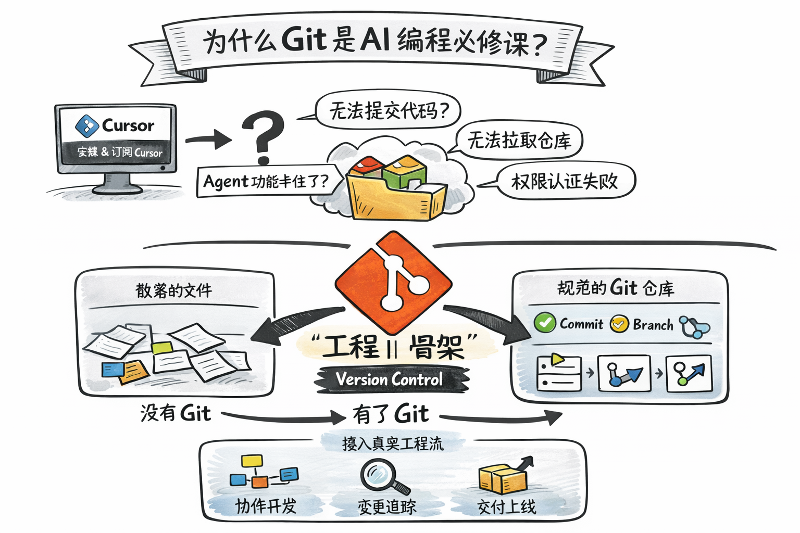

# 导学：环境配置与工具准备

<p align="center">
  <a href="./README.md">English</a> | <a href="./README_CN.md">中文</a>
</p>

> **《Vibe Coding AI全栈开发实战》** 课程前置准备

## 概述

在正式开启 Vibe Coding 之旅前，我们需要完成开发环境的配置。这一步看似简单，却是很多人在后续学习中遇到问题的根源。

**为什么 Git 是 AI 编程必修课？**

<div align="center">
  
</div>

Vibe Coding 的核心工具链——Cursor、GitHub、AI 模型服务——都依赖稳定的国际网络连接。没有 Git：
- ❌ 无法提交代码
- ❌ 无法拉取仓库
- ❌ Agent 功能卡住
- ❌ 权限认证失败

有了 Git，你将接入真实工程流：协作开发、变更追踪、交付上线。

---

## Git 与 GitHub 的关系

<div align="center">
  
</div>

- **Git**（本地）- 分布式、本地仓库、离线工作
- **GitHub**（远程）- 集中式、在线托管、团队协作、社交编码
- **Push** - 推送代码/上传
- **Pull/Clone** - 拉取/克隆代码

---

## 完整学习路径

<div align="center">
  
</div>

配置流程涵盖：
1. **Git 位置与价值** - 为什么必须学
2. **安装部署** - Windows / macOS / Linux
3. **首次配置与测试** - 用户名、邮箱、默认分支、Credential Manager

---

## 配置与验证流程

<div align="center">
  
</div>

三个关键步骤：
1. **身份配置** - 设置全局 user.name 和 user.email
2. **凭据绑定** - 配置 Credential Manager 和 GitHub Token
3. **集成验证** - 在 Cursor 中测试提交和推送

---

## 课程列表

| 编号 | 主题 | 说明 |
|:---|:---|:---|
| [Intro-01](./Lesson01_Network_and_VPN/) | 网络与VPN | 网络环境检测与 VPN 配置，确保 GitHub 和 AI 服务可访问 |
| [Intro-02](./Lesson02_Cursor_Setup/) | Cursor 配置 | Cursor AI IDE 安装、账户注册与 Pro 订阅 |
| [Intro-03](./Lesson03_Git_and_GitHub/) | Git 与 GitHub | Git 安装配置、GitHub 账户注册与 Token 配置 |

---

## 前置要求

- 一台 Windows / macOS / Linux 电脑
- 稳定的网络连接
- 基本的电脑操作能力（无需编程经验）

---

## 学习目标

完成本阶段后，你将能够：

- [x] 配置可访问 GitHub 和 AI 服务的网络环境
- [x] 安装并登录 Cursor AI IDE
- [x] 完成 Cursor Pro 订阅（可选）
- [x] 安装 Git 并配置 GitHub 账户
- [x] 使用 Cursor Agent 完成第一次代码提交

---

## 完成清单

在进入 Week 1 之前，请确保以下各项已完成：

```
[ ] VPN 配置完成，ip138.com 显示海外 IP
[ ] GitHub.com 可正常访问（3秒内加载）
[ ] Cursor 已安装并成功登录
[ ] Git 已安装，git --version 返回版本号
[ ] GitHub Personal Access Token 已创建
[ ] 能在 Cursor 中使用 Agent 执行 Git 操作
```

---

## 预计用时

| 课程 | 时间 |
|:---|:---|
| Intro-01：网络与VPN | 15-30 分钟 |
| Intro-02：Cursor 配置 | 20-30 分钟 |
| Intro-03：Git 与 GitHub | 20-30 分钟 |
| **总计** | **约 1.5 小时** |

---

## 下一步

完成环境配置后，进入 **[Week1：AI编程范式与快速上手](../Week1_AI_Programming_Fundamentals/)** 开始正式学习 Vibe Coding！

---

<p align="center">
  <b>《Vibe Coding AI全栈开发实战》</b><br>
  独家首发 Vibe Coding 全栈研发指南<br>
  从零深度实战 Cursor & Claude Code
</p>
