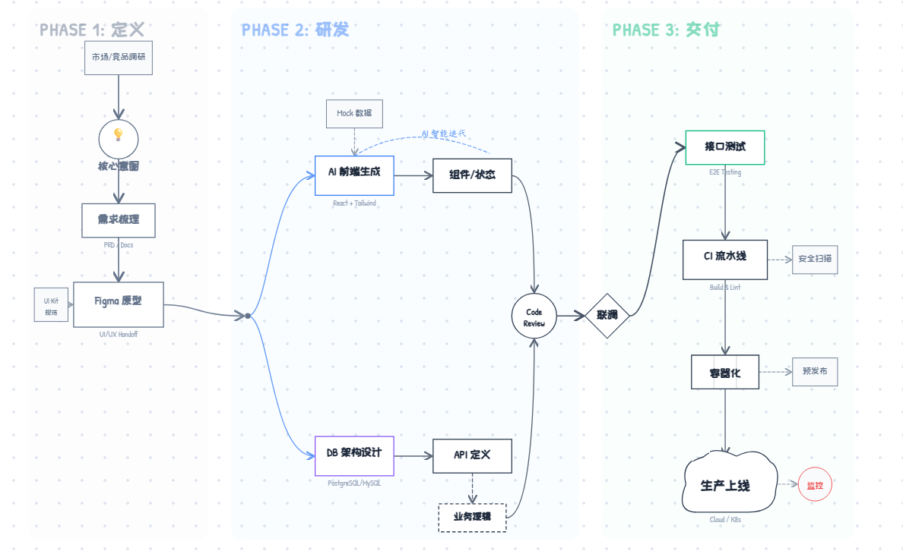
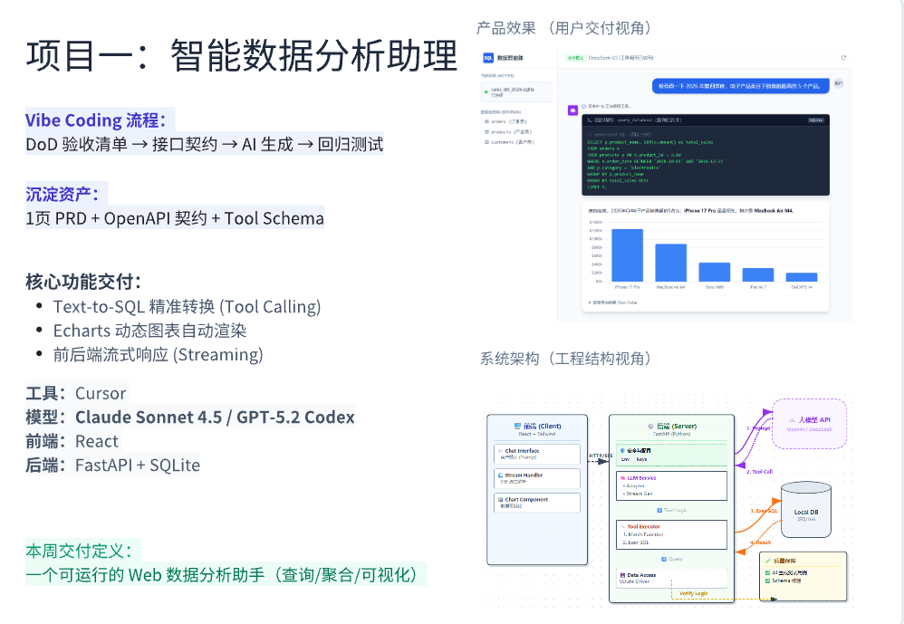
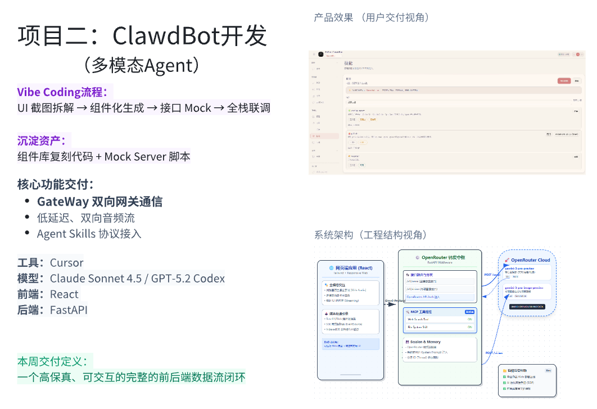
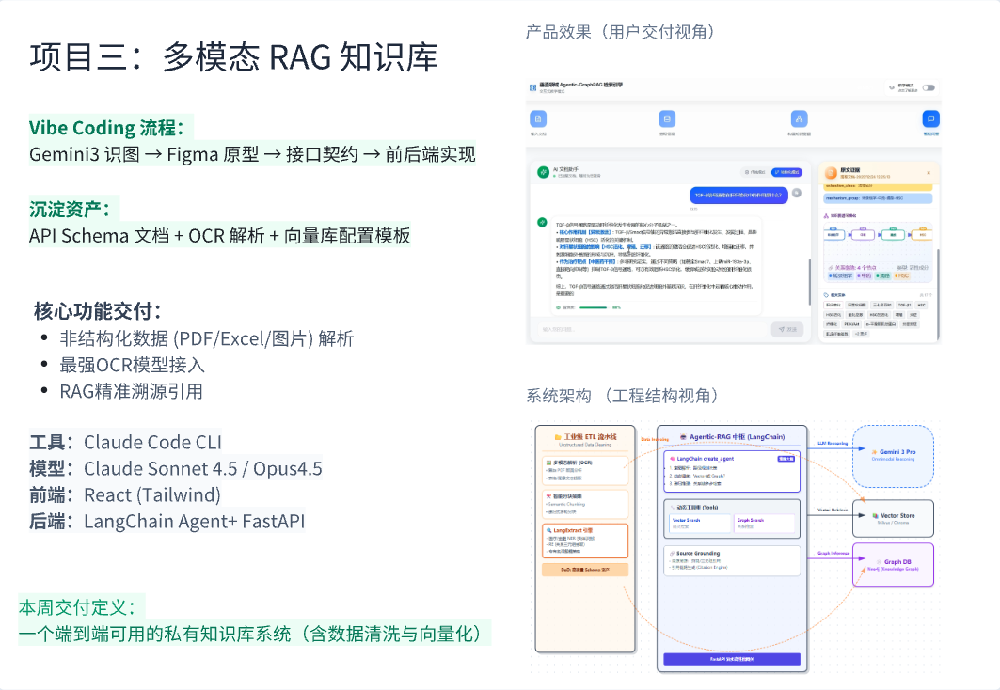
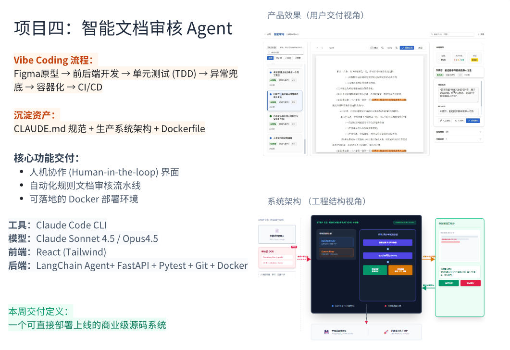

<p align="right">
  <a href="./README.md">English</a> | <a href="./README_CN.md">中文</a>
</p>

<div align="center">
  
</div>

<h1 align="center">《Vibe Coding AI全栈开发实战》</h1>

<p align="center">
  <b>2026 · AI编程首发特训营</b><br>
  从零深度实战 Cursor & Claude Code | 孵化 AI 时代"一人抵一队"超级个体
</p>

---

## 🎯 学习路径指南

> ⚠️ **重要提示**：请务必先完成**导学**部分，再开始 Week 1 的学习！

```
┌─────────────────────────────────────────────────────────────────┐
│                         学 习 路 径                              │
├─────────────────────────────────────────────────────────────────┤
│                                                                 │
│   ┌──────────────┐                                              │
│   │   从这里开始  │                                              │
│   └──────┬───────┘                                              │
│          ▼                                                      │
│   ┌──────────────────────────────────────┐                      │
│   │  📚 导学（必须先完成！）               │  ← VPN + Cursor + Git│
│   └──────────────────┬───────────────────┘                      │
│                      ▼                                          │
│   ┌──────────────────────────────────────┐                      │
│   │  Week 1：AI编程范式与快速上手         │  ← 项目一             │
│   └──────────────────┬───────────────────┘                      │
│                      ▼                                          │
│   ┌──────────────────────────────────────┐                      │
│   │  Week 2：Cursor AI IDE深入实践        │  ← 项目二             │
│   └──────────────────┬───────────────────┘                      │
│                      ▼                                          │
│   ┌──────────────────────────────────────┐                      │
│   │  Week 3：Claude Code工程实战          │  ← 项目三             │
│   └──────────────────┬───────────────────┘                      │
│                      ▼                                          │
│   ┌──────────────────────────────────────┐                      │
│   │  Week 4：企业级进阶实战               │  ← 项目四             │
│   └──────────────────────────────────────┘                      │
│                                                                 │
└─────────────────────────────────────────────────────────────────┘
```

### 第一步：完成导学（环境配置）

**👉 [进入导学 →](./00_Introduction/)**

<div align="center">

| 课程 | 内容 | 预计用时 |
|:---:|:---:|:---:|
| Intro-01 | 网络环境配置与 VPN 准备 | 15-30 分钟 |
| Intro-02 | Cursor AI IDE 安装与订阅 | 20-30 分钟 |
| Intro-03 | Git 安装与 GitHub 配置 | 20-30 分钟 |

</div>

✅ 完成导学后，你应该具备：
- VPN 配置完成（ip138.com 显示海外 IP）
- Cursor 已安装并登录
- Git 已安装，GitHub Token 已配置

### 第二步：按周学习

<div align="center">

| 周次 | 主题 | 链接 |
|:---:|:---:|:---:|
| Week 1 | AI编程范式与快速上手 | [开始学习 →](./Week1_AI_Programming_Fundamentals/) |
| Week 2 | Cursor AI IDE深入实践 | [开始学习 →](./Week2_Cursor_Deep_Dive/) |
| Week 3 | Claude Code工程实战 | [开始学习 →](./Week3_Claude_Code_Engineering/) |
| Week 4 | 企业级进阶实战 | [开始学习 →](./Week4_Enterprise_Practice/) |

</div>

---

## 🚀 Vibe Coding 研发新范式

<div align="center">
  
</div>

**AI 驱动开发的三个阶段：**

<div align="center">

| 阶段 | 重点 | 关键活动 |
|:---:|:---:|:---:|
| **Phase 1：定义** | 需求 | 市场/竞品调研 → 核心灵感 → 需求梳理 → Figma 原型 |
| **Phase 2：研发** | AI 辅助编码 | AI 前端生成 → DB 架构设计 → API 定义 → Code Review |
| **Phase 3：交付** | 部署 | 接口测试 → CI 流水线 → 容器化 → 生产上线 |

</div>

---

## 🏗️ 四大工业级项目实战

### 项目一：智能数据分析助理

<div align="center">
  
</div>

**Week 1 交付物**：一个可运行的 Web 数据分析助手（查询/聚合/可视化）

<div align="center">

| 技术栈 | 详情 |
|:---:|:---:|
| 工具 | Cursor |
| 模型 | Claude Sonnet 4.5 / GPT-5.2 Codex |
| 前端 | React |
| 后端 | FastAPI + SQLite |
| 核心功能 | Text-to-SQL 精准转换、Echarts 动态图表、前后端流式响应 |

</div>

---

### 项目二：ClawdBot 开发（多模态 Agent）

<div align="center">
  
</div>

**Week 2 交付物**：一个高保真、可交互的完整的前后端数据流闭环

<div align="center">

| 技术栈 | 详情 |
|:---:|:---:|
| 工具 | Cursor |
| 模型 | Claude Sonnet 4.5 / GPT-5.2 Codex |
| 前端 | React |
| 后端 | FastAPI |
| 核心功能 | GateWay 双向网关通信、低延迟双向音频流、Agent Skills 协议接入 |

</div>

---

### 项目三：多模态 RAG 知识库

<div align="center">
  
</div>

**Week 3 交付物**：一个端到端可用的私有知识库系统（含数据清洗与向量化）

<div align="center">

| 技术栈 | 详情 |
|:---:|:---:|
| 工具 | Claude Code CLI |
| 模型 | Claude Sonnet 4.5 / Opus 4.5 |
| 前端 | React (Tailwind) |
| 后端 | LangChain Agent + FastAPI |
| 核心功能 | 非结构化数据 (PDF/Excel/图片) 解析、最强 OCR 模型接入、RAG 精准溯源引用 |

</div>

---

### 项目四：智能文档审核 Agent

<div align="center">
  
</div>

**Week 4 交付物**：一个可直接部署上线的商业级源码系统

<div align="center">

| 技术栈 | 详情 |
|:---:|:---:|
| 工具 | Claude Code CLI |
| 模型 | Claude Sonnet 4.5 / Opus 4.5 |
| 前端 | React (Tailwind) |
| 后端 | LangChain Agent + FastAPI + Pytest + Git + Docker |
| 核心功能 | 人机协作 (Human-in-the-loop) 界面、自动化规则文档审核流水线、可落地的 Docker 部署环境 |

</div>

---

## 📋 课程概览

<div align="center">

| 阶段 | 主题 | 课时 | 项目实战 |
|:---:|:---:|:---:|:---:|
| **导学** | 环境配置与工具准备 | 3 | - |
| **Week 1** | AI编程范式与快速上手 | 2 | 智能数据分析助理 |
| **Week 2** | Cursor AI IDE深入实践 | 2 | ClawdBot |
| **Week 3** | Claude Code工程实战 | 2 | 多模态RAG知识库 |
| **Week 4** | 企业级进阶实战 | 1 | 智能文档审核Agent |

</div>

---

## ✅ 你将学到

- Vibe Coding vs 传统开发模式的本质差异
- Cursor & Claude Code 全流程实操
- 高性能 AI 编程核心技巧
- Prompt 工程与上下文优化
- Agent Skills 与 MCP 工具接入
- 四大工业级项目实战经验

---

## 📦 前置要求

- 基本电脑操作能力
- 学习热情和耐心
- **无需编程基础**（我们从零开始）

---

## 🚀 立即开始学习！

```bash
# 1. 克隆本仓库
git clone https://github.com/YOUR_USERNAME/VibeCodingCourse.git

# 2. 从导学开始
cd VibeCodingCourse/00_Introduction
```

**👉 [开启学习之旅：进入导学 →](./00_Introduction/)**

---

## License

MIT License

---

<p align="center">
  <b>《Vibe Coding AI全栈开发实战》</b><br>
  重塑AI时代编程竞争力 · 孵化AI时代超级个体<br>
  <br>
  <b>主讲老师：木羽老师</b>
</p>
