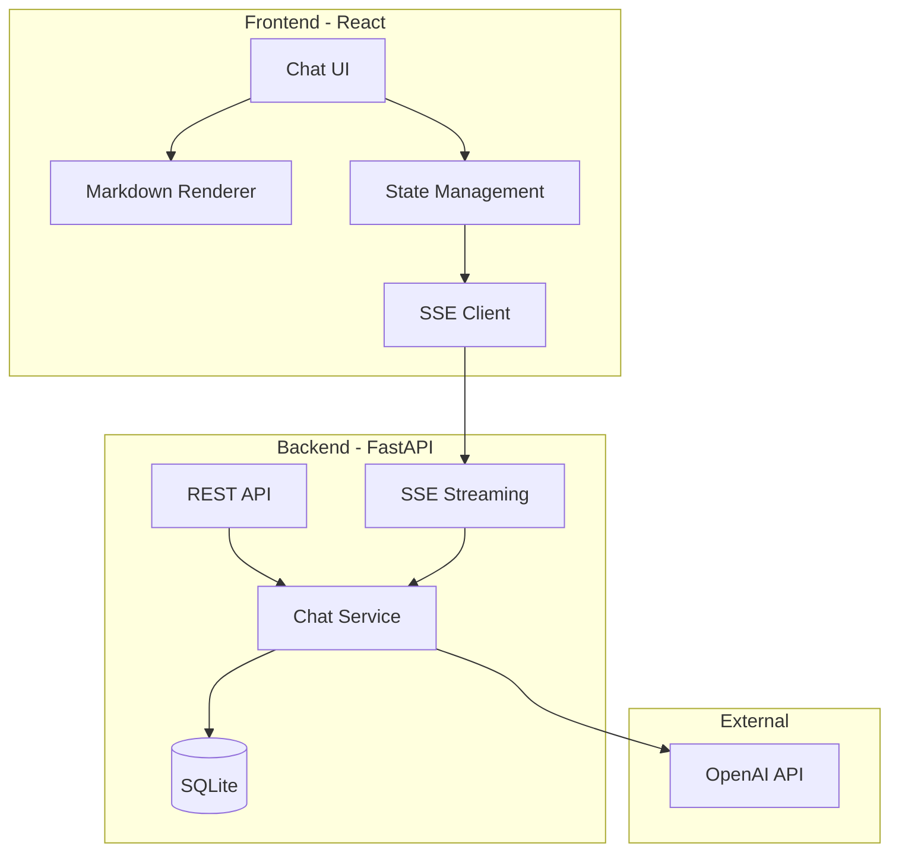

# 类ChatGPT对话系统架构规划

## 系统架构图



## 技术栈选择

| 层级 | 技术 | 理由 |

|------|------|------|

| 前端框架 | React 18 + Vite | 快速HMR，学习主流 |

| 样式 | Tailwind CSS | 快速构建现代UI |

| Markdown | react-markdown + highlight.js | 成熟稳定 |

| 流式处理 | EventSource (SSE) | 原生支持，简单可靠 |

| 后端框架 | FastAPI | 原生异步，自动文档，类型安全 |

| 数据库 | SQLite + SQLAlchemy | 零配置，学习项目足够 |

| AI接口 | openai Python SDK | 官方库，流式支持好 |

## 前端功能模块

### 1. 页面布局

```
+------------------+------------------------+
|                  |                        |
|   Sidebar        |      Chat Area         |
|   (对话列表)      |                        |
|                  |   Message List         |
|   - New Chat     |   - User messages      |
|   - History 1    |   - AI responses       |
|   - History 2    |                        |
|   - ...          |                        |
|                  |------------------------|
|                  |   Input Area           |
+------------------+------------------------+
```

### 2. 核心组件

| 组件 | 功能 |

|------|------|

| `ChatLayout` | 主布局，管理侧边栏和聊天区 |

| `Sidebar` | 对话历史列表，新建对话按钮 |

| `MessageList` | 消息渲染，自动滚动 |

| `MessageItem` | 单条消息，区分用户/AI，Markdown渲染 |

| `ChatInput` | 输入框，发送按钮，加载状态 |

| `MarkdownContent` | Markdown + 代码高亮渲染 |

### 3. 状态管理 (使用 React Context 或 Zustand)

```typescript
interface AppState {
  conversations: Conversation[]      // 对话列表
  currentConversationId: string      // 当前对话ID
  messages: Message[]                // 当前对话消息
  isStreaming: boolean               // 是否正在流式响应
}
```

### 4. 流式响应处理

- 使用 `EventSource` 接收 SSE 流
- 实时更新 AI 回复内容
- 打字机效果展示

## 后端功能模块

### 1. API 端点设计

| 方法 | 路径 | 功能 |

|------|------|------|

| POST | `/api/chat` | 发送消息，SSE流式返回 |

| GET | `/api/conversations` | 获取对话列表 |

| POST | `/api/conversations` | 创建新对话 |

| GET | `/api/conversations/{id}` | 获取对话详情和消息 |

| DELETE | `/api/conversations/{id}` | 删除对话 |

### 2. 数据模型

```python
# Conversation 表
- id: UUID
- title: String
- created_at: DateTime
- updated_at: DateTime

# Message 表  
- id: UUID
- conversation_id: FK
- role: Enum["user", "assistant"]
- content: Text
- created_at: DateTime
```

### 3. 核心服务

| 服务 | 功能 |

|------|------|

| `ChatService` | 调用OpenAI API，处理流式响应 |

| `ConversationService` | 对话CRUD操作 |

| `MessageService` | 消息存储和检索 |

### 4. SSE 流式实现

```python
async def chat_stream(messages: list):
    response = await openai.chat.completions.create(
        model="gpt-3.5-turbo",
        messages=messages,
        stream=True
    )
    async for chunk in response:
        yield f"data: {chunk.choices[0].delta.content}\n\n"
```

## 项目目录结构

```
chatgpt-clone/
├── frontend/
│   ├── src/
│   │   ├── components/
│   │   │   ├── ChatLayout.tsx
│   │   │   ├── Sidebar.tsx
│   │   │   ├── MessageList.tsx
│   │   │   ├── MessageItem.tsx
│   │   │   ├── ChatInput.tsx
│   │   │   └── MarkdownContent.tsx
│   │   ├── hooks/
│   │   │   ├── useChat.ts
│   │   │   └── useConversations.ts
│   │   ├── services/
│   │   │   └── api.ts
│   │   ├── store/
│   │   │   └── chatStore.ts
│   │   ├── types/
│   │   │   └── index.ts
│   │   ├── App.tsx
│   │   └── main.tsx
│   ├── package.json
│   └── vite.config.ts
│
├── backend/
│   ├── app/
│   │   ├── api/
│   │   │   ├── chat.py
│   │   │   └── conversations.py
│   │   ├── models/
│   │   │   └── models.py
│   │   ├── services/
│   │   │   ├── chat_service.py
│   │   │   └── conversation_service.py
│   │   ├── database.py
│   │   └── main.py
│   ├── requirements.txt
│   └── .env
│
└── README.md
```

## 实现步骤

### 阶段一：项目搭建

1. 初始化 React + Vite 前端项目
2. 初始化 FastAPI 后端项目
3. 配置 Tailwind CSS
4. 配置 CORS 和环境变量

### 阶段二：后端核心

1. 设计数据库模型，创建表
2. 实现 OpenAI API 集成（流式）
3. 实现对话管理 API
4. 实现 SSE 流式聊天端点

### 阶段三：前端核心

1. 实现基础布局组件
2. 实现消息列表和输入框
3. 集成 SSE 流式接收
4. 实现 Markdown 渲染和代码高亮

### 阶段四：完善功能

1. 实现侧边栏对话历史
2. 对话切换和新建
3. 优化 UI 细节和加载状态
4. 错误处理和边界情况

## 关键技术点

1. **SSE 流式传输**: 后端用 `StreamingResponse`，前端用 `EventSource`
2. **Markdown 渲染**: `react-markdown` + `rehype-highlight` 代码高亮
3. **状态同步**: 流式响应时实时更新 UI，完成后持久化到数据库
4. **对话上下文**: 每次请求携带历史消息，实现多轮对话