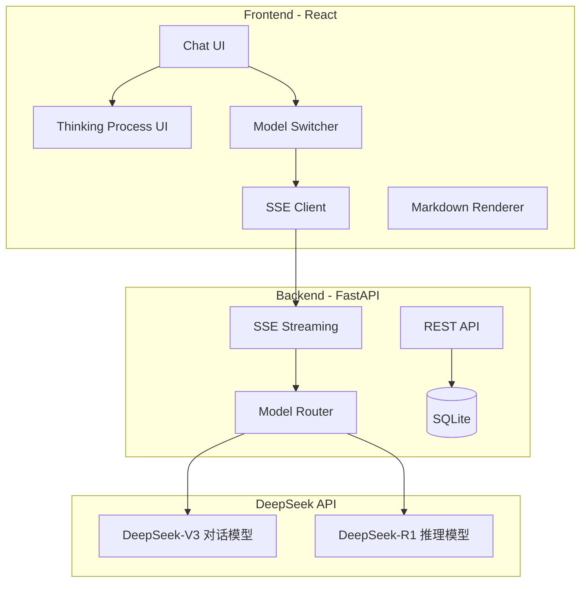
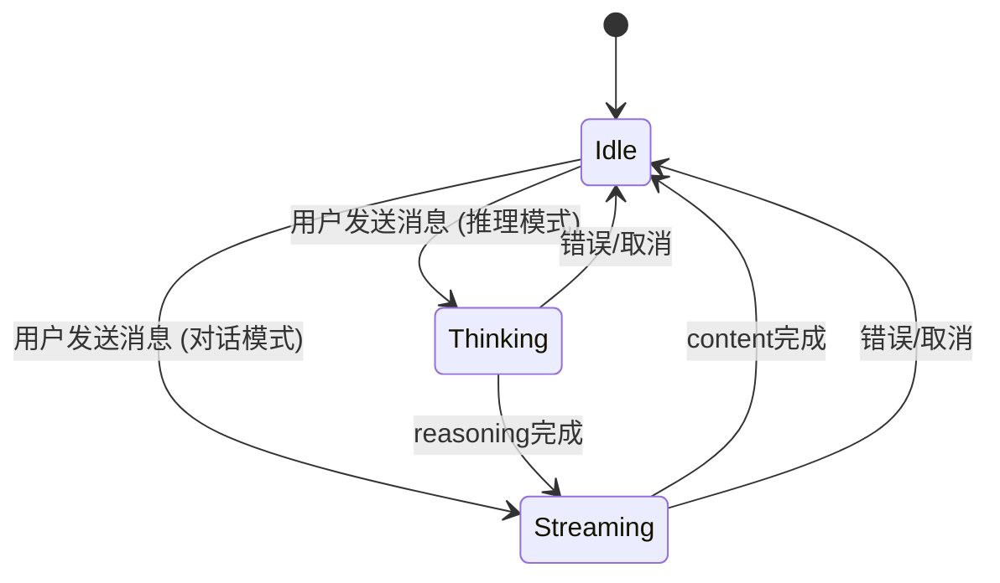
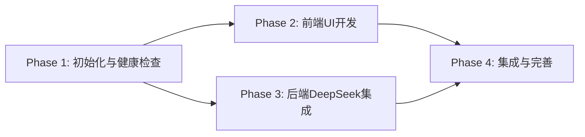

# DeepSeek 智能对话系统 - 分阶段实施计划

## 系统架构总览



---

## Phase 1: 项目初始化与健康检查

**目标**: 搭建前后端项目骨架，验证接口连通性

**预计时间**: 0.5 天

### 1.1 后端初始化

| 任务 | 说明 |

|------|------|

| 创建项目目录 | `chatgpt-clone/backend/` |

| 初始化虚拟环境 | `python -m venv venv` |

| 创建 requirements.txt | fastapi, uvicorn, openai, sqlalchemy, python-dotenv, sse-starlette |

| 创建 main.py | FastAPI 应用入口，配置 CORS |

| 创建健康检查端点 | `GET /api/health` |

| 创建 .env | DEEPSEEK_API_KEY 配置 |

**后端健康检查端点**:

```python
# GET /api/health
@app.get("/api/health")
async def health_check():
    return {
        "status": "healthy",
        "timestamp": datetime.now().isoformat(),
        "version": "1.0.0"
    }
```

### 1.2 前端初始化

| 任务 | 说明 |

|------|------|

| 创建 Vite + React 项目 | `npm create vite@latest frontend -- --template react-ts` |

| 安装 Tailwind CSS | 配置 tailwind.config.js |

| 安装核心依赖 | react-markdown, highlight.js, zustand, lucide-react |

| 配置 API 代理 | vite.config.ts → localhost:8000 |

| 创建健康检查组件 | 显示后端连接状态 |

### 1.3 健康度测试

| 测试项 | 预期结果 |

|--------|----------|

| 后端启动 | http://localhost:8000/docs 可访问 |

| 前端启动 | http://localhost:5173 可访问 |

| 前端调用 `/api/health` | 返回 healthy 状态 |

| CORS 验证 | 跨域请求正常 |

**交付物**:

- 前后端均可独立启动
- 健康检查接口联通
- 开发环境就绪

---

## Phase 2: 前端UI开发

**目标**: 完成聊天界面，包含思考过程展示UI

**预计时间**: 1.5 天

**依赖**: Phase 1 完成

### 2.1 类型定义

```typescript
// src/types/index.ts
type ModelType = 'deepseek-chat' | 'deepseek-reasoner'

interface Message {
  id: string
  role: 'user' | 'assistant'
  content: string
  reasoning_content?: string  // 推理模型的思考过程
  model: ModelType
  createdAt: string
}

interface Conversation {
  id: string
  title: string
  model: ModelType
  createdAt: string
}
```

### 2.2 核心组件

| 组件 | 文件 | 功能 |

|------|------|------|

| ChatLayout | `components/ChatLayout.tsx` | 主布局（侧边栏+聊天区） |

| Sidebar | `components/Sidebar.tsx` | 对话列表，新建对话 |

| ModelSelector | `components/ModelSelector.tsx` | 模型切换（对话/推理） |

| MessageList | `components/MessageList.tsx` | 消息列表容器 |

| MessageItem | `components/MessageItem.tsx` | 单条消息（含思考过程） |

| ThinkingBlock | `components/ThinkingBlock.tsx` | 思考过程折叠展示 |

| ChatInput | `components/ChatInput.tsx` | 输入框+发送 |

| MarkdownContent | `components/MarkdownContent.tsx` | Markdown渲染 |

### 2.3 思考过程UI设计

```
┌─────────────────────────────────────────────────┐
│  🤖 DeepSeek-R1                                 │
├─────────────────────────────────────────────────┤
│  ▼ 思考过程 (点击展开/折叠)                      │
│  ┌─────────────────────────────────────────────┐│
│  │ 让我分析一下这个问题...                      ││
│  │ 首先，我需要考虑...                          ││
│  │ 然后，根据...                               ││
│  │ 最终得出...                                 ││
│  └─────────────────────────────────────────────┘│
├─────────────────────────────────────────────────┤
│  最终答案:                                      │
│  根据分析，结果是...                            │
└─────────────────────────────────────────────────┘
```

**ThinkingBlock 组件特性**:

- 可折叠/展开
- 不同背景色区分（浅紫色/浅蓝色）
- 思考过程使用斜体或不同字体
- 流式展示时显示"思考中..."动画

### 2.4 模型选择器UI

```
┌──────────────────────────────────┐
│  选择模型                        │
│  ┌────────────┐ ┌────────────┐  │
│  │ 💬 对话    │ │ 🧠 推理    │  │
│  │ DeepSeek   │ │ DeepSeek   │  │
│  │ V3         │ │ R1         │  │
│  └────────────┘ └────────────┘  │
│                                  │
│  推理模式会展示AI的思考过程       │
└──────────────────────────────────┘
```

### 2.5 页面布局

```
+------------------+----------------------------------------+
|   LOGO           |  Model Selector  [💬 对话] [🧠 推理]   |
+------------------+----------------------------------------+
|                  |                                        |
|   New Chat       |                                        |
|                  |     MessageList                        |
|   ─────────      |     ├── UserMessage                    |
|   对话历史        |     ├── AssistantMessage               |
|   - Chat 1       |     │   ├── ThinkingBlock (可折叠)     |
|   - Chat 2       |     │   └── Content                    |
|   - Chat 3       |     └── ...                            |
|                  |                                        |
|                  +----------------------------------------+
|                  |   ChatInput                            |
|                  |   [________________] [Send]            |
+------------------+----------------------------------------+
```

### 2.6 状态管理 (Zustand)

```typescript
// src/store/chatStore.ts
interface ChatStore {
  // State
  messages: Message[]
  conversations: Conversation[]
  currentConversationId: string | null
  currentModel: ModelType
  isStreaming: boolean
  streamingReasoning: string  // 正在流式接收的思考内容
  streamingContent: string    // 正在流式接收的回答内容
  
  // Actions
  setModel: (model: ModelType) => void
  sendMessage: (content: string) => Promise<void>
  appendReasoning: (chunk: string) => void
  appendContent: (chunk: string) => void
  // ...
}
```

**交付物**:

- 完整的聊天UI
- 模型切换器
- 思考过程展示组件（使用 Mock 数据测试）
- 响应式布局

---

## Phase 3: 后端开发 (DeepSeek 集成)

**目标**: 实现数据库、DeepSeek API集成、流式响应

**预计时间**: 1.5 天

**依赖**: Phase 1 完成

### 3.1 DeepSeek API 说明

DeepSeek 提供两种模型：

| 模型 | API Model Name | 特点 |

|------|----------------|------|

| 对话模型 | `deepseek-chat` | 快速响应，常规对话 |

| 推理模型 | `deepseek-reasoner` | 返回 reasoning_content，展示思考过程 |

**API 兼容性**: DeepSeek API 兼容 OpenAI SDK，使用 `base_url="https://api.deepseek.com"` 即可。

### 3.2 数据库模型

```python
# app/models/models.py
class Conversation(Base):
    __tablename__ = "conversations"
    id = Column(String, primary_key=True)
    title = Column(String, default="New Chat")
    model = Column(String, default="deepseek-chat")  # 记录使用的模型
    created_at = Column(DateTime)
    updated_at = Column(DateTime)

class Message(Base):
    __tablename__ = "messages"
    id = Column(String, primary_key=True)
    conversation_id = Column(String, ForeignKey("conversations.id"))
    role = Column(String)  # "user" | "assistant"
    content = Column(Text)
    reasoning_content = Column(Text, nullable=True)  # 推理模型的思考过程
    model = Column(String)
    created_at = Column(DateTime)
```

### 3.3 DeepSeek 服务封装

```python
# app/services/deepseek_service.py
from openai import AsyncOpenAI

client = AsyncOpenAI(
    api_key=os.getenv("DEEPSEEK_API_KEY"),
    base_url="https://api.deepseek.com"
)

async def stream_chat(messages: list, model: str = "deepseek-chat"):
    """对话模型流式响应"""
    response = await client.chat.completions.create(
        model=model,
        messages=messages,
        stream=True
    )
    async for chunk in response:
        if chunk.choices[0].delta.content:
            yield {"type": "content", "data": chunk.choices[0].delta.content}

async def stream_reasoning(messages: list):
    """推理模型流式响应 - 包含思考过程"""
    response = await client.chat.completions.create(
        model="deepseek-reasoner",
        messages=messages,
        stream=True
    )
    async for chunk in response:
        delta = chunk.choices[0].delta
        # 推理模型返回 reasoning_content 和 content 两个字段
        if hasattr(delta, 'reasoning_content') and delta.reasoning_content:
            yield {"type": "reasoning", "data": delta.reasoning_content}
        if delta.content:
            yield {"type": "content", "data": delta.content}
```

### 3.4 API 端点

| 端点 | 方法 | 功能 |

|------|------|------|

| `GET /api/health` | GET | 健康检查 |

| `POST /api/chat` | POST | 聊天（SSE流式返回） |

| `GET /api/conversations` | GET | 获取对话列表 |

| `POST /api/conversations` | POST | 创建新对话 |

| `GET /api/conversations/{id}` | GET | 获取对话详情 |

| `DELETE /api/conversations/{id}` | DELETE | 删除对话 |

| `GET /api/models` | GET | 获取可用模型列表 |

### 3.5 聊天端点实现

```python
# app/api/chat.py
@router.post("/chat")
async def chat(request: ChatRequest):
    return StreamingResponse(
        chat_stream_generator(request),
        media_type="text/event-stream"
    )

async def chat_stream_generator(request: ChatRequest):
    model = request.model
    messages = [{"role": m.role, "content": m.content} for m in request.messages]
    
    full_reasoning = ""
    full_content = ""
    
    if model == "deepseek-reasoner":
        async for chunk in stream_reasoning(messages):
            if chunk["type"] == "reasoning":
                full_reasoning += chunk["data"]
                yield f"data: {json.dumps(chunk)}\n\n"
            else:
                full_content += chunk["data"]
                yield f"data: {json.dumps(chunk)}\n\n"
    else:
        async for chunk in stream_chat(messages, model):
            full_content += chunk["data"]
            yield f"data: {json.dumps(chunk)}\n\n"
    
    # 发送完成信号
    yield f"data: {json.dumps({'type': 'done', 'reasoning': full_reasoning, 'content': full_content})}\n\n"
```

### 3.6 SSE 数据格式

```
# 推理模型响应流
data: {"type": "reasoning", "data": "让我思考一下..."}
data: {"type": "reasoning", "data": "首先分析问题..."}
data: {"type": "content", "data": "根据分析，"}
data: {"type": "content", "data": "答案是..."}
data: {"type": "done", "reasoning": "完整思考过程", "content": "完整回答"}

# 对话模型响应流
data: {"type": "content", "data": "你好！"}
data: {"type": "content", "data": "有什么可以帮助你的？"}
data: {"type": "done", "content": "完整回答"}
```

**交付物**:

- 数据库模型完成
- DeepSeek API 集成（两种模型）
- SSE 流式端点可用
- 思考过程正确返回

---

## Phase 4: 前后端集成与功能完善

**目标**: 完成前后端联调，实现完整功能

**预计时间**: 1 天

**依赖**: Phase 2, Phase 3 完成

### 4.1 SSE 客户端实现

```typescript
// src/services/api.ts
export async function streamChat(
  messages: Message[],
  model: ModelType,
  onReasoning: (chunk: string) => void,
  onContent: (chunk: string) => void,
  onDone: () => void
) {
  const response = await fetch('/api/chat', {
    method: 'POST',
    headers: { 'Content-Type': 'application/json' },
    body: JSON.stringify({ messages, model })
  })
  
  const reader = response.body!.getReader()
  const decoder = new TextDecoder()
  
  while (true) {
    const { done, value } = await reader.read()
    if (done) break
    
    const lines = decoder.decode(value).split('\n')
    for (const line of lines) {
      if (line.startsWith('data: ')) {
        const data = JSON.parse(line.slice(6))
        if (data.type === 'reasoning') onReasoning(data.data)
        else if (data.type === 'content') onContent(data.data)
        else if (data.type === 'done') onDone()
      }
    }
  }
}
```

### 4.2 流式响应状态处理



### 4.3 思考过程流式展示

- 推理模式下，先展示"思考中..."
- 实时显示 reasoning_content
- reasoning 完成后，开始显示 content
- ThinkingBlock 支持流式更新

### 4.4 功能完善清单

| 功能 | 说明 |

|------|------|

| 模型切换 | 切换后新对话使用新模型 |

| 对话历史加载 | 正确显示历史消息的思考过程 |

| 思考过程折叠 | 默认折叠，点击展开 |

| 加载状态 | 发送中禁用输入，显示动画 |

| 错误处理 | API失败时显示错误提示 |

| 自动滚动 | 新内容时滚动到底部 |

| 快捷键 | Enter发送，Shift+Enter换行 |

| 停止生成 | 可中断流式响应 |

### 4.5 UI 细节优化

- 思考过程使用不同背景色（如浅紫色）
- 思考过程字体使用斜体
- 模型切换时有视觉反馈
- 推理模式显示"🧠 思考中..."
- 对话模式显示"💬 生成中..."

**交付物**:

- 完整可用的聊天系统
- 推理/对话模式切换
- 思考过程流式展示
- 对话历史管理

---

## 最终项目结构

```
chatgpt-clone/
├── frontend/
│   ├── src/
│   │   ├── components/
│   │   │   ├── ChatLayout.tsx
│   │   │   ├── Sidebar.tsx
│   │   │   ├── ModelSelector.tsx
│   │   │   ├── MessageList.tsx
│   │   │   ├── MessageItem.tsx
│   │   │   ├── ThinkingBlock.tsx
│   │   │   ├── ChatInput.tsx
│   │   │   └── MarkdownContent.tsx
│   │   ├── hooks/
│   │   │   ├── useChat.ts
│   │   │   └── useConversations.ts
│   │   ├── services/
│   │   │   └── api.ts
│   │   ├── store/
│   │   │   └── chatStore.ts
│   │   ├── types/
│   │   │   └── index.ts
│   │   ├── App.tsx
│   │   └── main.tsx
│   ├── package.json
│   └── vite.config.ts
│
├── backend/
│   ├── app/
│   │   ├── api/
│   │   │   ├── chat.py
│   │   │   └── conversations.py
│   │   ├── models/
│   │   │   └── models.py
│   │   ├── services/
│   │   │   └── deepseek_service.py
│   │   ├── database.py
│   │   └── main.py
│   ├── requirements.txt
│   └── .env
│
└── README.md
```

---

## 阶段依赖关系



## 时间估算

| Phase | 内容 | 时间 | 并行 |

|-------|------|------|------|

| Phase 1 | 项目初始化与健康检查 | 0.5 天 | - |

| Phase 2 | 前端UI开发 | 1.5 天 | 可与P3并行 |

| Phase 3 | 后端DeepSeek集成 | 1.5 天 | 可与P2并行 |

| Phase 4 | 前后端集成与完善 | 1 天 | - |

| **总计** | | **3-4 天** | |