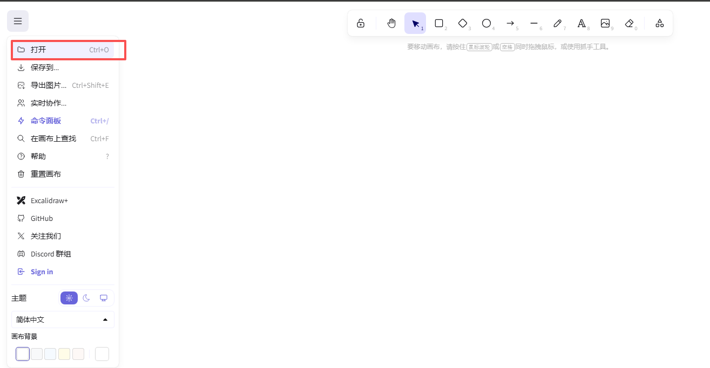

# 第一周：AI 编程基础

[English](./README.md) | 中文

## 学习目标

建立 AI 编程习惯，完成 LLM API 对接，构建可运行的智能应用。

## 课程安排

- **[Lesson 01](./Lesson01_Dev_Workflow_and_Environment/Courseware/README_CN.md)**：开发工作流与环境配置
  - Vibe Coding AI 编程范式
  - Cursor 快速上手实践
  - ChatGPT Clone 实战项目

- **[Lesson 02](./Lesson02_LLM_API_and_Data_Assistant/Courseware/README_CN.md)**：LLM API 对接与智能数据助手
  - Cursor 四种问答模型应用
  - MCP Server 集成与配置
  - 智能数据分析助理实战

## 学习成果

能够独立将 AI 产品原型转化为可运行的应用程序（前端 + 后端 + LLM 调用）

---

## 课件说明

### 关于 `.excalidraw` 文件

`.excalidraw` 文件是**原始可编辑课件**，你可以根据需要进行修改和定制。

**打开方式：**

1. 访问 [https://excalidraw.com/](https://excalidraw.com/)（需要梯子）
2. 点击菜单图标 (☰) → **打开** (Ctrl+O)
3. 选择本地的 `.excalidraw` 文件

